# 🎵 Copyright Detector Music Backend

**Professional .NET Core Web API for Music Similarity Detection and Copyright Analysis**

[](https://dotnet.microsoft.com/)
[](https://www.python.org/)
[](https://github.com/facebookresearch/faiss)

Created by **[Sergie Code](https://github.com/sergiecode)** - Software Engineer & YouTube Programming Educator  
**🎓 AI Tools for Musicians Series**

---

## 🎯 Project Overview

This is the **central orchestration layer** for the AI Tools for Musicians series - a production-ready .NET Core Web API that seamlessly integrates:

- **[copyright-detector-music-embeddings](../copyright-detector-music-embeddings)** - Audio embedding extraction
- **[copyright-detector-vector-search](../copyright-detector-vector-search)** - FAISS-based similarity search

The backend provides RESTful endpoints for large-scale music similarity analysis, copyright detection, and audio processing workflows.

### 🎪 Three-Repository Integration

```mermaid
graph TD
    A[🎵 Music Embeddings<br/>Python Module] --> C[🌐 Backend API<br/>.NET Core]
    B[🔍 Vector Search<br/>Python Module] --> C
    C --> D[🌍 Web Interface]
    C --> E[📱 Mobile Apps]
    C --> F[🔌 External APIs]
    
    style A fill:#e1f5fe
    style B fill:#f3e5f5
    style C fill:#e8f5e8
    style D fill:#fff3e0
    style E fill:#fce4ec
    style F fill:#e0f2f1
```



---

## 🚀 Features

### ⚡ High-Performance API
- **RESTful endpoints** for audio analysis and similarity search
- **Async processing** with real-time progress tracking
- **File upload support** with validation and size limits
- **Batch processing** capabilities for multiple files
- **Comprehensive error handling** and logging

### 🎵 Music Intelligence
- **Multi-model support** (Spectrogram, OpenL3, AudioCLIP)
- **Copyright risk assessment** with 4-level scoring
- **Cover version detection** with configurable thresholds
- **Metadata extraction** and analysis
- **Real-time similarity scoring**

### 🔧 Production Ready
- **Swagger/OpenAPI documentation** with interactive UI
- **Health monitoring** and status endpoints
- **CORS support** for cross-origin requests
- **Structured logging** with configurable levels
- **Docker support** for containerized deployment

---

## 📋 Installation & Setup

### Prerequisites

```bash
# .NET 9.0 SDK
dotnet --version

# Python 3.8+ with pip
python --version

# Git for cloning repositories
git --version
```

### 1. Clone the Repository Structure

```bash
# Create the project directory
mkdir AI-Tools-for-Musicians
cd AI-Tools-for-Musicians

# Clone all three repositories
git clone https://github.com/sergiecode/copyright-detector-music-embeddings.git
git clone https://github.com/sergiecode/copyright-detector-vector-search.git
git clone https://github.com/sergiecode/copyright-detector-music-backend.git

# Your directory structure should look like:
# AI-Tools-for-Musicians/
# ├── copyright-detector-music-embeddings/
# ├── copyright-detector-vector-search/
# └── copyright-detector-music-backend/
```

### 2. Setup Python Dependencies

```bash
# Navigate to the backend directory
cd copyright-detector-music-backend

# Install Python dependencies for all modules
pip install -r python/requirements.txt

# Install dependencies for music-embeddings module
cd ../copyright-detector-music-embeddings
pip install -r requirements.txt

# Install dependencies for vector-search module
cd ../copyright-detector-vector-search
pip install -r requirements.txt

# Return to backend directory
cd ../copyright-detector-music-backend
```

### 3. Setup .NET Dependencies

```bash
# Restore .NET packages
dotnet restore

# Build the project
dotnet build
```

### 4. Configuration

Edit `appsettings.json` to match your environment:

```json
{
  "PythonConfig": {
    "PythonPath": "python",  // or "python3" on some systems
    "ScriptsPath": "./python",
    "EmbeddingsRepoPath": "../copyright-detector-music-embeddings",
    "VectorSearchRepoPath": "../copyright-detector-vector-search"
  },
  "VectorSearch": {
    "IndexPath": "./data/music_index.faiss",
    "DefaultTopK": 10,
    "SimilarityThreshold": 0.8
  }
}
```

---

## 🏃‍♂️ Running the Application

### Development Mode

```bash
# Start the API server
dotnet run

# The API will be available at:
# https://localhost:7000 - HTTPS
# http://localhost:5000 - HTTP

# Swagger UI will be available at:
# https://localhost:7000/ (root path in development)
```

### Production Mode

```bash
# Build for production
dotnet publish -c Release -o ./publish

# Run the published application
cd publish
./CopyrightDetector.MusicBackend.exe  # Windows
# or
./CopyrightDetector.MusicBackend      # Linux/macOS
```

---

## 📚 API Documentation

### Base URL
- Development: `https://localhost:7000`
- Production: `https://your-domain.com`

### Health Check

```http
GET /health
```

**Response:**
```json
{
  "Status": "Healthy",
  "Timestamp": "2025-08-29T10:30:00Z",
  "Version": "1.0.0",
  "Service": "Copyright Detector Music Backend"
}
```

### API Status

```http
GET /api/search/status
```

**Response:**
```json
{
  "Status": "Running",
  "Version": "1.0.0",
  "SupportedFormats": [".wav", ".mp3", ".flac", ".m4a", ".ogg"],
  "SupportedModels": ["spectrogram", "openl3", "audioclip"],
  "PythonPath": "python",
  "EmbeddingsRepo": "../copyright-detector-music-embeddings",
  "VectorSearchRepo": "../copyright-detector-vector-search"
}
```

### Analyze Audio File (Path-based)

```http
POST /api/search/analyze
Content-Type: application/json

{
  "audioFilePath": "/path/to/audio/file.wav",
  "modelName": "spectrogram",
  "topK": 10,
  "similarityThreshold": 0.8
}
```

**Response:**
```json
{
  "success": true,
  "similarTracks": [
    {
      "filename": "similar_song.wav",
      "artist": "Artist Name",
      "album": "Album Name",
      "genre": "Rock",
      "similarityScore": 0.92,
      "distance": 0.08,
      "copyrightRisk": "HIGH",
      "duration": 240.5,
      "year": 2023
    }
  ],
  "copyrightRisk": "HIGH",
  "riskScore": 0.856,
  "totalMatches": 5,
  "processingTimeMs": 2340
}
```

### Upload and Analyze Audio File

```http
POST /api/search/upload-and-analyze
Content-Type: multipart/form-data

audioFile: [binary file data]
modelName: "spectrogram"
topK: 10
similarityThreshold: 0.8
```

**Response:**
```json
{
  "success": true,
  "fileInfo": {
    "originalFilename": "test_song.wav",
    "savedFilename": "guid-12345.wav",
    "fileSizeBytes": 5242880,
    "contentType": "audio/wav",
    "uploadTimestamp": "2025-08-29T10:30:00Z"
  },
  "embeddingResult": {
    "success": true,
    "embeddings": [0.123, 0.456, ...],
    "shape": [128],
    "model": "spectrogram",
    "duration": 240.5,
    "sampleRate": 22050
  },
  "searchResult": {
    "success": true,
    "similarTracks": [...],
    "copyrightRisk": "MEDIUM",
    "riskScore": 0.724,
    "totalMatches": 3
  },
  "totalProcessingTimeMs": 3250
}
```

### Extract Embeddings Only

```http
POST /api/search/extract-embeddings
Content-Type: application/json

{
  "audioFilePath": "/path/to/audio/file.wav",
  "modelName": "spectrogram"
}
```

**Response:**
```json
{
  "success": true,
  "embeddings": [0.123, 0.456, 0.789, ...],
  "shape": [128],
  "model": "spectrogram",
  "duration": 240.5,
  "sampleRate": 22050
}
```

---

## 🧪 Usage Examples

### Example 1: Basic Copyright Check (PowerShell)

```powershell
# Test the copyright detection API
$response = Invoke-RestMethod -Uri "https://localhost:7000/api/search/analyze" `
    -Method POST `
    -ContentType "application/json" `
    -Body (@{
        audioFilePath = "C:\music\test_song.wav"
        modelName = "spectrogram"
        topK = 5
        similarityThreshold = 0.8
    } | ConvertTo-Json)

Write-Host "Copyright Risk: $($response.copyrightRisk)"
Write-Host "Risk Score: $($response.riskScore)"
Write-Host "Similar Tracks Found: $($response.totalMatches)"
```

### Example 2: File Upload with Curl

```bash
# Upload and analyze an audio file
curl -X POST "https://localhost:7000/api/search/upload-and-analyze" \
     -F "audioFile=@./music/test_song.wav" \
     -F "modelName=spectrogram" \
     -F "topK=10" \
     -F "similarityThreshold=0.8"
```

### Example 3: Batch Processing (C#)

```csharp
using System.Net.Http.Json;

var client = new HttpClient();
var baseUrl = "https://localhost:7000";

var audioFiles = new[] 
{
    "song1.wav", "song2.wav", "song3.wav"
};

foreach (var audioFile in audioFiles)
{
    var request = new AudioAnalysisRequest
    {
        AudioFilePath = $"C:\\music\\{audioFile}",
        ModelName = "spectrogram",
        TopK = 10,
        SimilarityThreshold = 0.8
    };

    var response = await client.PostAsJsonAsync($"{baseUrl}/api/search/analyze", request);
    var result = await response.Content.ReadFromJsonAsync<SimilaritySearchResult>();

    Console.WriteLine($"{audioFile}: Risk={result.CopyrightRisk}, Score={result.RiskScore}");
}
```

### Example 4: JavaScript Frontend Integration

```javascript
// Upload and analyze audio file from a web form
async function analyzeAudio(audioFile) {
    const formData = new FormData();
    formData.append('audioFile', audioFile);
    formData.append('modelName', 'spectrogram');
    formData.append('topK', '10');
    formData.append('similarityThreshold', '0.8');

    try {
        const response = await fetch('/api/search/upload-and-analyze', {
            method: 'POST',
            body: formData
        });

        const result = await response.json();
        
        if (result.success) {
            displayResults(result.searchResult);
        } else {
            console.error('Analysis failed:', result.error);
        }
    } catch (error) {
        console.error('Error:', error);
    }
}

function displayResults(searchResult) {
    const riskElement = document.getElementById('copyright-risk');
    riskElement.textContent = searchResult.copyrightRisk;
    riskElement.className = `risk-${searchResult.copyrightRisk.toLowerCase()}`;

    const tracksElement = document.getElementById('similar-tracks');
    tracksElement.innerHTML = '';
    
    searchResult.similarTracks.forEach(track => {
        const trackElement = document.createElement('div');
        trackElement.innerHTML = `
            <h4>${track.filename}</h4>
            <p>Artist: ${track.artist}</p>
            <p>Similarity: ${(track.similarityScore * 100).toFixed(1)}%</p>
            <p>Risk: ${track.copyrightRisk}</p>
        `;
        tracksElement.appendChild(trackElement);
    });
}
```

---

## 🔗 Integration Architecture

### How It Works

1. **Audio File Processing**
   ```
   Audio File → Embeddings Module → Vector Array (128D-2048D)
   ```

2. **Similarity Search**
   ```
   Vector Array → FAISS Index → Similar Tracks + Distances
   ```

3. **Copyright Analysis**
   ```
   Similarity Scores → Risk Assessment → Risk Level + Score
   ```

4. **API Response**
   ```
   Results → JSON Serialization → HTTP Response
   ```

### Integration with Python Modules

The backend communicates with Python modules through wrapper scripts:

**Embedding Extraction:**
```
.NET API → embedding_wrapper.py → music-embeddings module → JSON result
```

**Vector Search:**
```
.NET API → search_wrapper.py → vector-search module → JSON result
```

### Data Flow


---

## 🔧 Configuration

### Environment Variables

```bash
# Python Configuration
PYTHON_PATH=python
SCRIPTS_PATH=./python
EMBEDDINGS_REPO_PATH=../copyright-detector-music-embeddings
VECTOR_SEARCH_REPO_PATH=../copyright-detector-vector-search

# Vector Search Configuration
INDEX_PATH=./data/music_index.faiss
DEFAULT_TOP_K=10
SIMILARITY_THRESHOLD=0.8

# File Upload Configuration
MAX_FILE_SIZE_MB=50
UPLOAD_PATH=./uploads

# API Configuration
ASPNETCORE_ENVIRONMENT=Development
ASPNETCORE_URLS=https://localhost:7000;http://localhost:5000
```

### appsettings.json

```json
{
  "Logging": {
    "LogLevel": {
      "Default": "Information",
      "Microsoft.AspNetCore": "Warning",
      "CopyrightDetector.MusicBackend": "Information"
    }
  },
  "PythonConfig": {
    "PythonPath": "python",
    "ScriptsPath": "./python",
    "EmbeddingsRepoPath": "../copyright-detector-music-embeddings",
    "VectorSearchRepoPath": "../copyright-detector-vector-search"
  },
  "VectorSearch": {
    "IndexPath": "./data/music_index.faiss",
    "DefaultTopK": 10,
    "SimilarityThreshold": 0.8
  },
  "FileUpload": {
    "MaxFileSizeMB": 50,
    "AllowedExtensions": [".wav", ".mp3", ".flac", ".m4a", ".ogg"],
    "UploadPath": "./uploads"
  }
}
```

---

## 🐳 Docker Deployment

### Dockerfile

```dockerfile
# Build stage
FROM mcr.microsoft.com/dotnet/sdk:9.0 AS build
WORKDIR /app

# Copy project files
COPY *.csproj ./
RUN dotnet restore

# Copy source code
COPY . ./
RUN dotnet publish -c Release -o out

# Runtime stage
FROM mcr.microsoft.com/dotnet/aspnet:9.0
WORKDIR /app

# Install Python and dependencies
RUN apt-get update && apt-get install -y python3 python3-pip
COPY python/requirements.txt ./
RUN pip3 install -r requirements.txt

# Copy the application
COPY --from=build /app/out ./
COPY python/ ./python/

# Expose ports
EXPOSE 8080

# Set environment variables
ENV ASPNETCORE_URLS=http://*:8080
ENV ASPNETCORE_ENVIRONMENT=Production

# Run the application
ENTRYPOINT ["dotnet", "CopyrightDetector.MusicBackend.dll"]
```

### docker-compose.yml

```yaml
version: '3.8'

services:
  music-backend:
    build: .
    ports:
      - "8080:8080"
    environment:
      - ASPNETCORE_ENVIRONMENT=Production
      - ASPNETCORE_URLS=http://*:8080
    volumes:
      - ./data:/app/data
      - ./uploads:/app/uploads
      - ../copyright-detector-music-embeddings:/app/embeddings:ro
      - ../copyright-detector-vector-search:/app/vector-search:ro
    depends_on:
      - redis
      
  redis:
    image: redis:alpine
    ports:
      - "6379:6379"
    volumes:
      - redis_data:/data

volumes:
  redis_data:
```

### Build and Run

```bash
# Build the Docker image
docker build -t copyright-detector-backend .

# Run the container
docker run -p 8080:8080 copyright-detector-backend

# Or use docker-compose
docker-compose up -d
```

---

## 🧪 Testing

### Unit Tests

```bash
# Run unit tests
dotnet test

# Run with coverage
dotnet test --collect:"XPlat Code Coverage"
```

### Integration Tests

```bash
# Test the API endpoints
curl -X GET "https://localhost:7000/health"
curl -X GET "https://localhost:7000/api/search/status"
```

### Performance Testing

```bash
# Load test with artillery.io
npm install -g artillery
artillery run load-test.yml
```

Example `load-test.yml`:
```yaml
config:
  target: 'https://localhost:7000'
  phases:
    - duration: 60
      arrivalRate: 10
scenarios:
  - name: "Health check"
    requests:
      - get:
          url: "/health"
```

---

## 📊 Monitoring & Logging

### Health Monitoring

The API includes built-in health checks:

- `/health` - Basic health status
- `/api/search/status` - Detailed API status

### Logging

Structured logging is configured for:

- Request/response logging
- Python script execution
- Error tracking
- Performance metrics

### Metrics

Monitor these key metrics:

- Request response times
- Python script execution times
- Error rates
- File upload success rates
- Memory usage

---

## 🚀 Production Deployment

### Deployment Checklist

- [ ] Configure production `appsettings.json`
- [ ] Set up Python environment with all dependencies
- [ ] Ensure FAISS index is available and optimized
- [ ] Configure reverse proxy (nginx/IIS)
- [ ] Set up SSL certificates
- [ ] Configure monitoring and logging
- [ ] Set up backup procedures for indexes
- [ ] Configure rate limiting
- [ ] Set up health checks

### Scaling Considerations

- **Horizontal Scaling**: Deploy multiple API instances behind a load balancer
- **Python Process Pool**: Use process pooling for Python script execution
- **Caching**: Implement Redis caching for frequently accessed embeddings
- **Index Sharding**: Split large FAISS indexes across multiple services
- **Async Processing**: Use message queues for long-running analysis tasks

---

## 🤝 Contributing

### Development Setup

```bash
# Fork and clone the repository
git clone https://github.com/your-username/copyright-detector-music-backend.git
cd copyright-detector-music-backend

# Create a development branch
git checkout -b feature/your-feature-name

# Install dependencies
dotnet restore
pip install -r python/requirements.txt

# Run the application
dotnet run
```

### Code Style

- Follow C# coding conventions
- Use XML documentation for public APIs
- Follow RESTful API design principles
- Write unit tests for new features
- Update documentation for changes

---

## 🙏 Acknowledgments

- **Microsoft** - For the excellent .NET ecosystem
- **Python Community** - For the amazing ML libraries
- **FAISS Team** - For the incredible vector search capabilities
- **Music Information Retrieval Community** - For research and inspiration

---

## 📞 Support & Contact

- **Creator**: [Sergie Code](https://github.com/sergiecode)
- **YouTube**: [Programming Education Channel](https://youtube.com/@sergiecode)
- **Issues**: [GitHub Issues](https://github.com/sergiecode/copyright-detector-music-backend/issues)
- **Documentation**: [API Documentation](https://localhost:7000) (when running)

---

## 🎯 Related Projects

| Project | Description | Repository |
|---------|-------------|------------|
| **Music Embeddings** | Audio → Vector conversion | [music-embeddings](https://github.com/sergiecode/copyright-detector-music-embeddings) |
| **Vector Search** | FAISS-based similarity search | [vector-search](https://github.com/sergiecode/copyright-detector-vector-search) |

---

**⭐ Star this repository if it helps with your music technology projects!**

*Built with ❤️ for the music and AI communities by Sergie Code*

### Connect with Sergie Code
- 📸 Instagram: https://www.instagram.com/sergiecode
- 🧑🏼‍💻 LinkedIn: https://www.linkedin.com/in/sergiecode/
- 📽️ Youtube: https://www.youtube.com/@SergieCode
- 😺 Github: https://github.com/sergiecode
- 👤 Facebook: https://www.facebook.com/sergiecodeok
- 🎞️ Tiktok: https://www.tiktok.com/@sergiecode
- 🕊️ Twitter: https://twitter.com/sergiecode
- 🧵 Threads: https://www.threads.net/@sergiecode

---

**Happy Music Analysis! 🎵**
